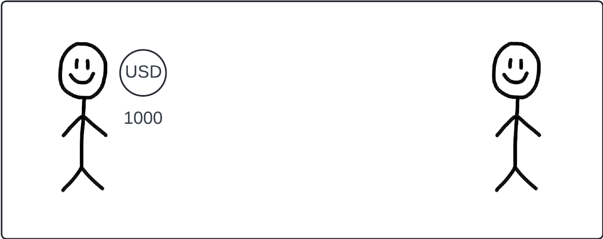
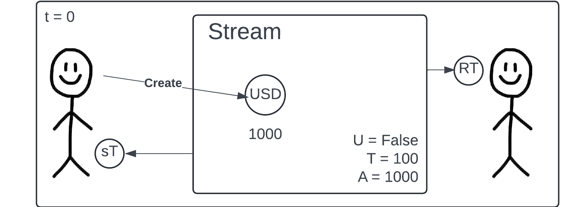
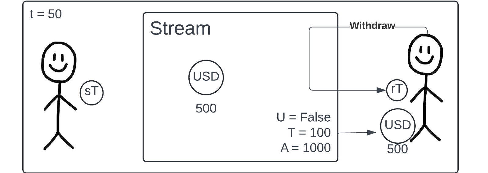
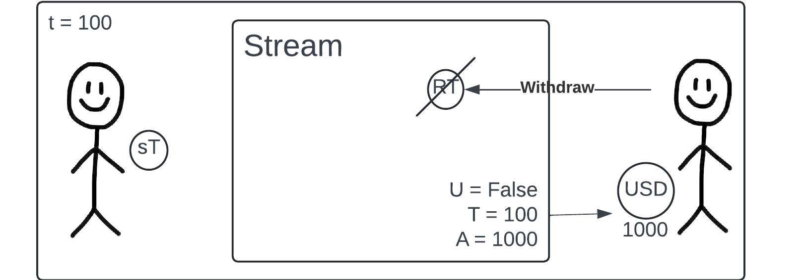
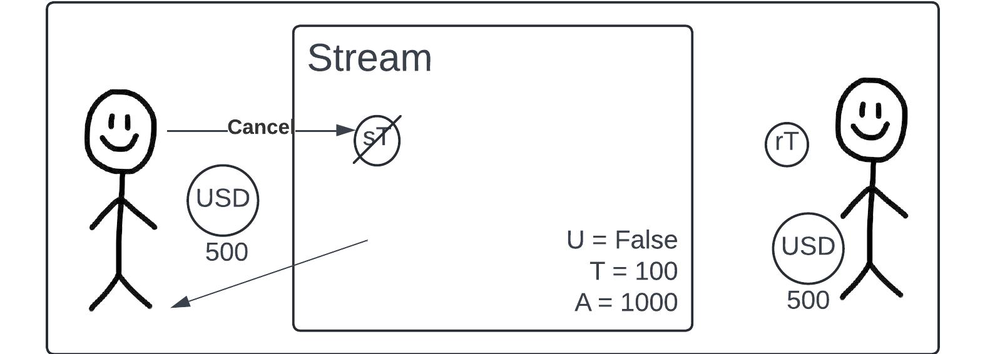
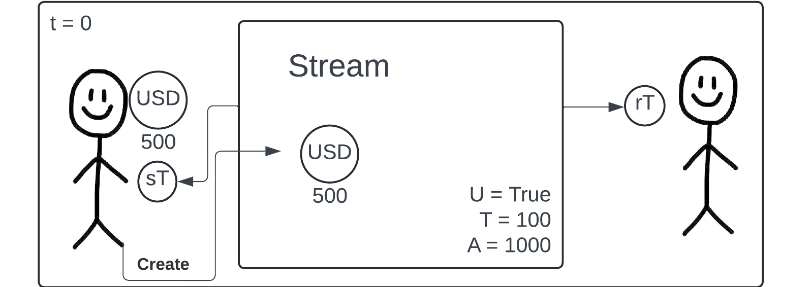
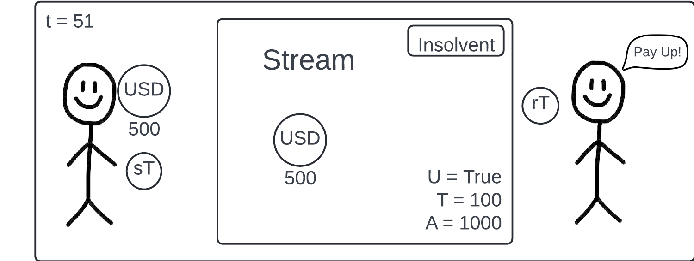
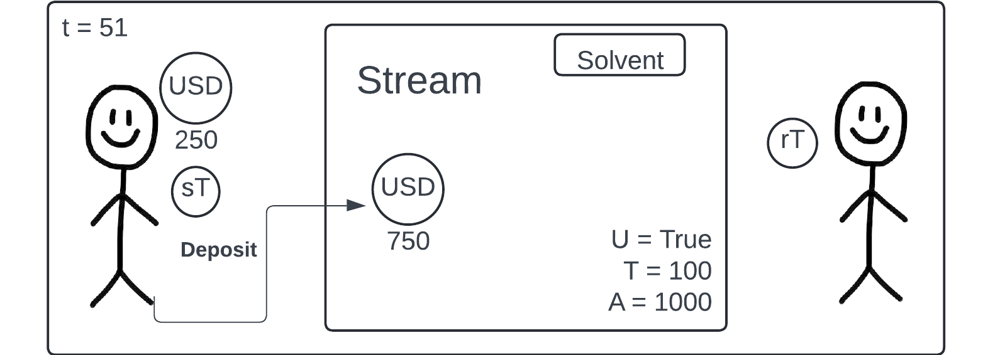

# Pipeline Docs

## What is Pipeline

Pipeline is a token streaming platform. It allows fuel accounts to send native assets to other accounts on a vesting curve.

For payments this allows receivers to access what they are owed on a regular basis, and decreases the management overhead from a sender setting up recurring payments.

For airdrops this allows for token vesting to prevent immediate token dumping.

For examples of streaming platforms on other chains see:

- Sablier
- Superfluid

## Stream feature set

### Current Features

- Vesting schedule: All stream are linearly vested
- Transferability: The cancellation and withdraw capabilities on a stream are granted by the holding the sender_token (sT) and receiver_token (rT) respectively. By transferring either of these tokens to another account, you effectively transfer the role to the new account.
- Cancellability (Optional): Streams can be cancelled by the sender. Sender receives all unvested tokens back, receiver keeps all vested tokens.
- Undercollateralization (Optional): Streams can be undercollateralized. Sender can create a stream with a total value greater than the initial deposit. If the vested tokens are ever greater than the total deposits, the stream is considered insolvent. This requires off-chain handling of

### Future Features

- Non-linear vesting schedules
- Custom vesting curves
- Gas sponsorship for withdrawal transactions for senders
- Divisible streams: Setting up a single stream that has multiple claimants with custom distributions

## Stream Flow overview

### Stream creation

1. A sender has 1000 USD and wants to send all of it to a receiver over 100 days.

2. A sender creates a stream with the following attributes. Cancellable, fully-collateralized (U=false), 100 days long (T=100), and total amount 1000 USD (A=1000).
3. Sender includes 1000 USD in the create stream call as the deposit. As the stream is fully-collateralized, the initial deposit will always be equal to A.
4. The sender receives and sender_token (sT) which represents ownership of the streams sending side. Ownership of the sT represents the ability to cancel the stream and claim unvested tokens.
5. The recipient receives a receiver_token (rT) which represents ownership of the streams receiving side. Ownership of the rT represents the ability to withdraw vested tokens.

### Withdrawal and Cancellation

1. Halfway through the life of the stream (50 days in). The receiver decides to claim some tokens. They submit a withdraw transaction for the 500 tokens (the total vested amount). They must forward their receiver_token to prove ownership of the stream.
2. The receiver receives back their receiver_token as well as 500USD from the stream.

3. At the end of the stream the receiver decides to claim the rest of their tokens. They do the same process as at t=50, and receive the rest of their tokens (500USD). The rT is destroyed instead of returned to the receiver.

4. In an alternate reality the sender decided to cancel the stream at t=50, after the user’s withdrawal. The sender forwards their sender_token with a cancel call.
5. The stream is then cancelled, sender_token destroyed, and all unvested tokens are returned to the sender. If there were vested tokens remaining in the stream, the receiver would still have a claim on them. E.g. if t=60, the sender would receive 400USD on cancellation, and 100USD would remain in the stream for claim by the receiver.

### Under-collateralized Streams

1. A sender creates a stream with the following attributes. Cancellable, under-collateralized (U=true), 100 days long (T=100), and total amount 1000 USD (A=1000).
2. Sender includes 500 USD in the create stream call as the deposit. As the stream is under-collateralized, the initial deposit can be less than A.
3. The sender receives and sender_token (sT) which represents ownership of the streams sending side. Ownership of the sT represents the ability to cancel the stream and claim unvested tokens.
4. The recipient receives a receiver_token (rT) which represents ownership of the streams receiving side. Ownership of the rT represents the ability to withdraw vested tokens.

5. At t=51, the number of vested tokens is 510USD which is greater than the total deposit of 500USD. The stream is now insolvent. Insolvency is handled on the social layer between the sender and receiver. Often this will be the receiver notifying the sender that the stream is insolvent and they should deposit additional funds.

6. If the sender deposits greater than the vested amount, the stream will once again be solvent. Here the sender deposits 250USD more for a total deposit of 750USD which is greater than the vested amount of 510USD. The stream will now be solvent until t>75. Receivers can withdraw vested tokens up to the deposited amount even if the stream is insolvent, and they will still receive the full amount of tokens they are owed after the sender deposits more funds.

## Technical Details

The TokenStreaming contract is a singleton contract that is responsible for managing all streams. It is the only contract that can create, cancel, and withdraw streams.

### Standards compatibility

- SRC-20: The TokenStreaming contract is SRC-20 (token standard compatible). Each stream generates two tokens, one for the sender and one for the receiver. We refer to these as receiver_tokens (rT) and sender_tokens (sT).

- SRC-6: The TokenStreaming contract is SRC-6 (vault standard) compatible. Each stream is represented by two vaults. One for the sender and one for the receiver. As time passes, the withrdawable value from each vault changes based on the stream's vesting schedule.

### Interfaces

See [SRC-20](https://docs.fuel.network/docs/sway-standards/src-20-native-asset/) for the SRC-20 standard.
See [SRC-6](https://docs.fuel.network/docs/sway-standards/src-6-vault/) for the SRC-6 standard.
See [interfaces.sw](../contracts/token-streaming/src/interface.sw) for the interface definitions of all other functions.

### Stream Datastructure

See [structs.sw](../contracts/token-streaming/src/structs.sw) to see the stream data structure.

### Implemenation and Function Signature Docs

See [main.sw](../contracts/token-streaming/src/main.sw) to see the implemenation and docs for function signatures. Due to a limitation with forc docs these are not included in the docs generated by `forc doc`.

### Additional documenation

This will be hosted soon, but for now you can view the docs locally.

Generate documentation with:
`cd contracts/token-streaming && forc doc --open`
